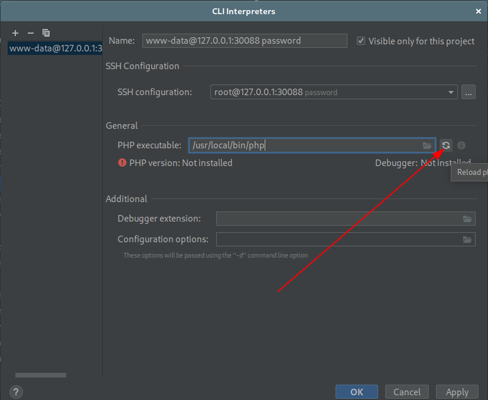

## 0. Сделать форк проекта

## 1. Инициализация проекта
1.0 Создать папку `app` в папке, куда был склонирован проект

1.1. Запустить в папке команду, в папке, куда был склонирован проект:
`docker-compose up -d`

1.2. Зайти в контейнер с приложением
`docker exec -it -u www-data symfony_internship_app bash`

1.3. Запустить в контейнере с приложением команду для установки скелета симфони 4.4 
https://symfony.com/doc/4.4/setup.html

`composer create-project symfony/website-skeleton:"^4.4" ./`

1.4. Перейти в браузере по адресу http://127.0.0.1:889
Делаем первый коммит "Installed Symfony"

## 2. Настройка xdebug
### 2.1 Для связки Linux + Docker + PhpStorm
 - выполним в app контейнере (symfony_internship_app) `ip route | grep default | awk '{print $3}'` 
 - в .env, который лежит в корне репозитория, `XDEBUG_CONFIG=remote_host=172.17.0.1` ip нужно изменить на полученный в предидущем пункте ip адрес и пересобрать контейнеры
 `docker-compose up -d`
 
### 2.2 Настройка PHPStorm
 - настраиваем PHP language level `File | Settings | Languages & Frameworks | PHP` 
  
  
  
  
  
  
  Далее создаем соединение с такими данными:
  
  127.0.0.1
  
  300088
  
  root
  
  oddsdev
  
  
  
  
  
  
  
  
  
  
  

### 2.3 Проверка xdebug
#### 2.3.0 Создать LuckyController
https://symfony.com/doc/4.4/page_creation.html

#### 2.3.1 Поставить брейкпойт 

#### 2.3.3 Открыть в браузере
http://127.0.0.1:889/lucky/number

#### 2.3.4 Открыть в phpstorm вкладку Debugger

#### 2.3.5 Cконфигурировать сервер

#### 2.3.6 Cконфигурировать мапинг

#### 2.3.7 Убедиться, что произошла остановка на брейкпойнте

## 3. Запушить код симфони
с коммитом "#0 Symfony initialization"

## 4. Переход к решению практических задач
[Задача 1](doc/task_1.md)

[Задача 2](doc/task_2.md)

[Задача 3](doc/task_3.md)

[Задача 4](doc/task_4.md)

[Задача 5](doc/task_5.md)
